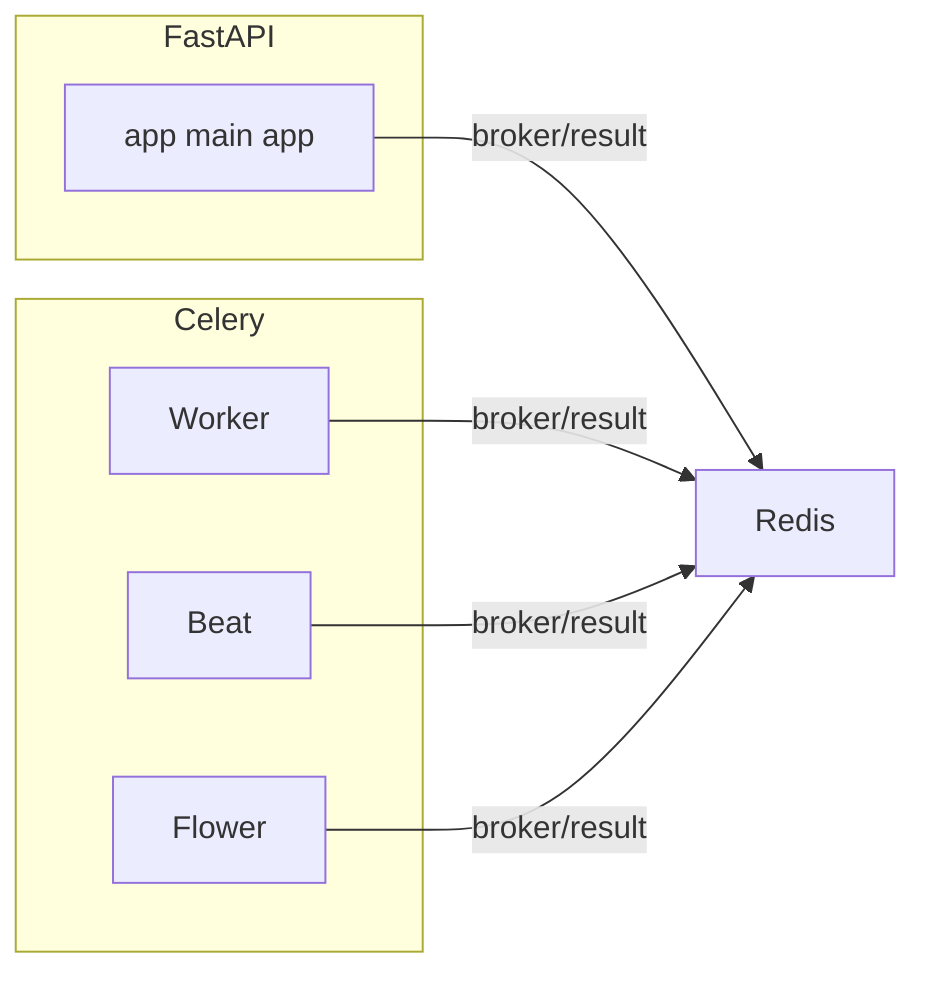

README_MD = """
# Celery + FastAPI + Redis: Microservices Isolados com Docker

## 📖 Visão Geral
Este projeto demonstra como separar cada serviço (API, worker, beat, flower, Redis) em contêineres Docker isolados, utilizando FastAPI para a API HTTP e Celery para processamento assíncrono.  
Você verá:
- Arquitetura de microserviços com Docker Compose  
- Dockerfile baseado em Alpine com entrypoint unificado  
- Configuração de ambiente e variáveis  
- Execução e monitoramento com Flower  

## 🎯 Arquitetura


## 📂 Estrutura de Diretórios
```
.
├── docker-compose.yml
├── Dockerfile
├── docker-entrypoint.sh
├── requirements.txt
├── .env
└── app
    ├── main.py
    └── celery
        ├── app.py
        └── worker.py
```

## ⚙️ Pré-requisitos
- Docker ≥ 20.10  
- Docker Compose  
- Python ≥ 3.11 (local, para testes opcionais)  

## 🔧 Configuração de Ambiente
1. Copie `.env.example` para `.env` e ajuste se necessário:
   ```env
   CELERY_BROKER_URL=redis://redis:6379/0
   CELERY_RESULT_BACKEND=redis://redis:6379/0
   ```
2. Verifique `docker-entrypoint.sh`:
   ```sh
   #!/usr/bin/env bash
   set -e
   case "$1" in
     api)    exec uvicorn app.main:app --host 0.0.0.0 --port 8000 --workers 2 ;;
     worker) exec celery -A app.celery.app worker --loglevel=info --concurrency=2 ;;
     beat)   exec celery -A app.celery.app beat --loglevel=info ;;
     flower) exec celery -A app.celery.app flower --port=5555 --loglevel=info ;;
     *)      echo "Usage: $0 {api|worker|beat|flower}" ; exit 1 ;;
   esac
   ```

## 📦 Dockerfile
```dockerfile
FROM python:3.11-alpine
WORKDIR /app

# 1. Instala bash para entrypoint
RUN apk add --no-cache bash

ENV PYTHONDONTWRITEBYTECODE=1
ENV PYTHONUNBUFFERED=1

# 2. Dependências
COPY requirements.txt docker-entrypoint.sh ./
RUN chmod +x docker-entrypoint.sh \
 && pip install --upgrade pip \
 && pip install --no-cache-dir -r requirements.txt

# 3. Cópia do código
COPY . .

# 4. Portas da API (8000) e Flower (5555)
EXPOSE 8000 5555

# 5. Entrypoint e comando padrão
ENTRYPOINT ["/bin/bash", "/app/docker-entrypoint.sh"]
CMD ["api"]
```

## 📑 docker-compose.yml
```yaml
version: '3.8'
services:
  api:
    build: .
    container_name: api
    command: ["api"]
    ports:
      - "8001:8000"
    depends_on: [redis]

  worker:
    build: .
    container_name: celery_worker
    command: ["worker"]
    depends_on: [redis]

  beat:
    build: .
    container_name: celery_beat
    command: ["beat"]
    depends_on: [redis]

  flower:
    build: .
    container_name: celery_flower
    command: ["flower"]
    ports:
      - "5556:5555"
    depends_on: [redis]

  redis:
    image: redis:7
    container_name: redis
    ports:
      - "6379:6379"
```

## 🚀 Como Executar
```bash
# 1. Build e up
docker-compose up --build -d

# 2. Logs em tempo real
docker-compose logs -f api celery_worker celery_beat celery_flower

# 3. Acessar:
#   • API:  http://localhost:8001/
#   • Flower: http://localhost:5556/
```

## 📝 Roteiro para o Vídeo (YouTube)
| Tempo  | Seção                                        |
|--------|-----------------------------------------------|
| 00:00  | Introdução e Objetivos                       |
| 01:30  | Visão Geral da Arquitetura                   |
| 03:00  | Explorando o Dockerfile                      |
| 05:00  | Configuração do docker-entrypoint.sh         |
| 06:30  | Analisando o docker-compose.yml              |
| 08:00  | Build, Deploy e Demonstração ao Vivo         |
| 10:00  | Monitoramento com Flower                     |
| 11:30  | Conclusão e Próximos Passos                  |

---
"""
